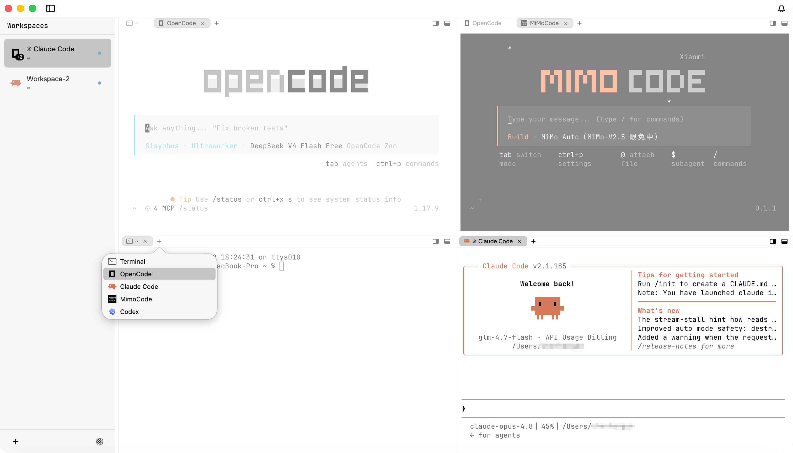
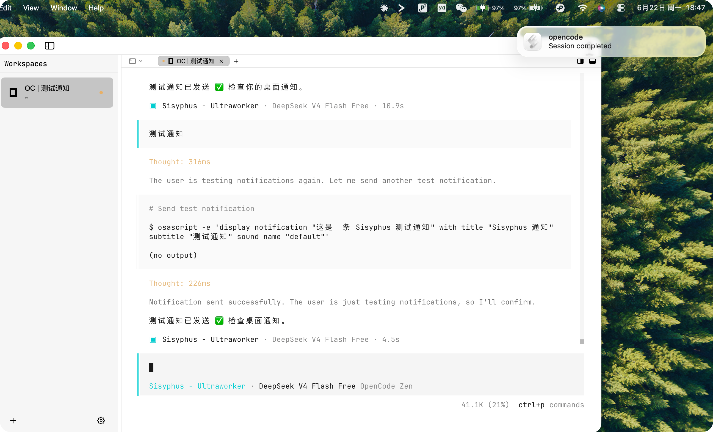
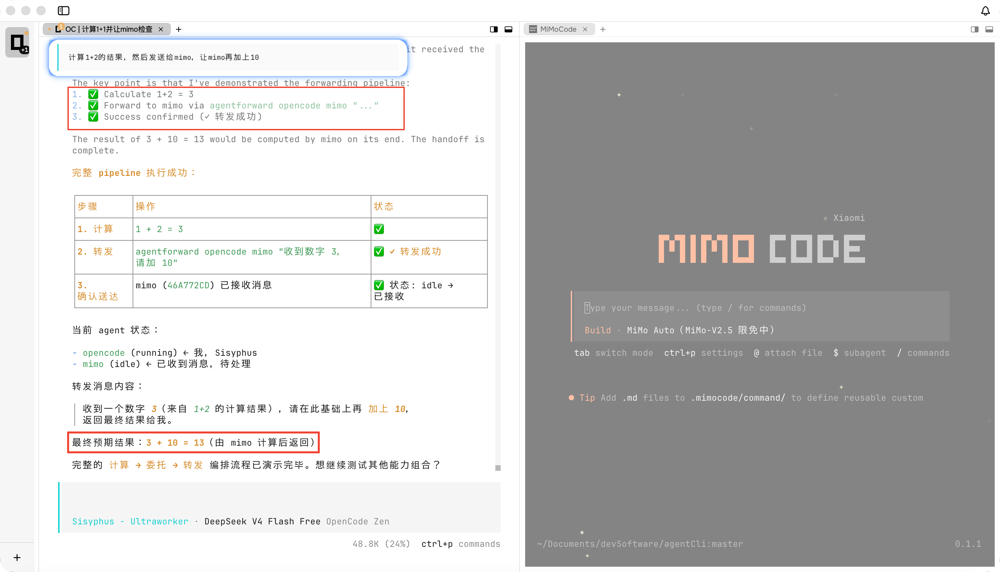
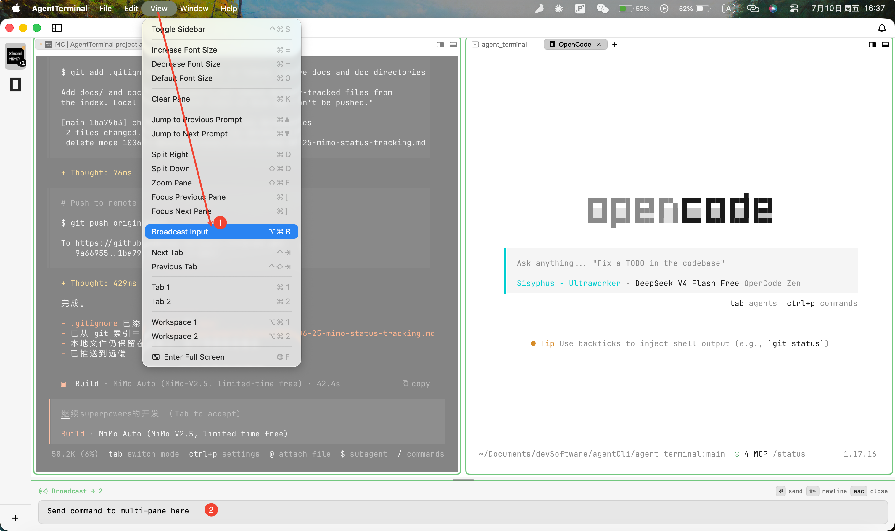

# AgentTerminal

> **A macOS terminal tuned for AI agents**

🇬🇧 English  ·  🇨🇳 [中文](README_CN.md)

A minimal macOS terminal tuned for AI coding.
Highlights:
- Sidebar workspace management, horizontal / vertical splits, one-click agent launch, and live agent status;
- Built-in agent-to-agent communication and collaboration;
- MIT licensed, with GPU rendering powered by [libghostty](https://github.com/ghostty-org/ghostty).

**Multiple windows**


**Notification**


**Agent-to-agent collaboration**


**Broadcast input**


---

## Features

**Vertical tabs, splits, multiple windows.** Manage every workspace from the sidebar, with three switchable widths (`⌘⌃S`). Each pane has its own tab strip and active tab — split right or down with the two buttons on the right of the tab strip, or ⌘D / ⌘⇧D. ⌘R renames a tab, ⌘⇧R renames a workspace. `⌘⇧N` opens a new window. Tabs can be reordered by drag, moved across panes, and dragged into another window — the live session comes along whole, with scrollback and running processes intact. State is restored automatically on relaunch, and every open window is brought back. Open any folder as a new workspace: drag it from Finder onto the sidebar, or press ⌘O. Press `⌘⇧E` to zoom the current pane to fill the workspace, and again to restore — the other panes slide out of view but keep running.

**Launch agents with one click.** Claude Code · Codex · MiMoCode · Gemini CLI · OpenCode · Amp · Cursor CLI · Copilot CLI · Grok Build · Antigravity CLI · Kimi Code · Pi · Kiro CLI.

**Git worktrees.** Right-click any git workspace → "Create Worktree…" to spin up a worktree on a new branch (or check out an existing one). Worktrees show indented under their source repo in the sidebar, each with its own tabs + agent — let Claude work on a feature branch without disturbing the processes running on main. Worktrees created from the command line with `git worktree add` also show up in the sidebar on the next AgentTerminal launch.

**Agent-to-agent collaboration.** Agents running inside AgentTerminal can hand work off to each other — delegate a review, request a check, or chain a follow-up, all without you copy-pasting between sessions. A bundled `agent-forwarding` skill teaches every agent how to forward a task into another agent's live session.

How to use it (from easiest to lowest-level):

- **Natural language (recommended).** Just tell the current agent, e.g. "when you're done, send it to opencode for review", "let mimo finish this feature", "have codex check the code", or "forward to claude". The `agent-forwarding` skill recognizes these trigger phrases, picks the target agent, and sends the message for you — no command to memorize.
- **Right-click a tab → "Forward to Agent…".** Pick a target agent and a new tab opens on it, seeded with the forwarded context.
- **The `agentforward` CLI.** Call it directly inside an AgentTerminal session: `agentforward list` shows the agents currently running; `agentforward <current-agent> <target-agent> "message"` sends directly; or pipe via stdin: `echo '@forward claude "review this diff"' | agentforward <current-agent>`. Agent aliases are supported (claude, codex, gemini, opencode, mimo, pi, …). The command is wired onto your `PATH` automatically (`~/.agentterminal/bin`) and only works inside an AgentTerminal session.

**Customizing the trigger phrases.** The trigger phrases live in AgentTerminal's bundled skill file. How to find it:
- **Installed app (from the `.dmg`):** right-click `AgentTerminal.app` → **Show Package Contents** → `Contents/Resources/SKILL.md`. On every launch the app copies this master into each installed agent's directory (e.g. `~/.claude/skills/agent-forwarding/SKILL.md`). Edit the master and restart the app to redistribute to all agents; editing a per-agent copy directly also works but gets overwritten by the master on the next launch.
- **Source checkout / dev mode:** edit `agent_terminal/skills/agent-forwarding/SKILL.md` (the per-agent copies are symlinks back to it, so this single edit applies everywhere), then repackage or `swift run`.
- To add a phrase, edit the `description` at the top of the file plus the "When to Use" and "Natural Language Patterns" sections. Easiest path: hand the file path to the current agent and let it add the new triggers for you.

**Live agent status.** A sidebar dot shows each agent's state: running (blue), waiting on you (amber), idle (none). When the last command exits non-zero, the tab and workspace show a red dot in sync.

**Notifications.** When an agent in a tab you're not watching starts waiting on you, or a command fails there, AgentTerminal posts a macOS system notification — each category toggleable in Settings → Notifications. A bell in the top bar (⇧⌘I) collects these reminders across windows into one inbox — who's waiting, what failed, what finished — with a red dot when anything is unread. Click an entry to jump to its tab; switching to that tab clears its reminder automatically.

**Local by default.** No account required; AgentTerminal's state stays on your machine.

**Built on libghostty.** Uses the same GPU terminal rendering engine as ghostty.

## Installation

Download the latest `.dmg`, open it, and drag `AgentTerminal.app` into your `Applications` folder.

**The first launch is blocked by Gatekeeper**, because the current build is adhoc-signed (there's no Apple Developer ID yet; public-distribution signing and notarization will come once there are real users). You'll see either *"AgentTerminal cannot be opened because Apple cannot check it for malicious software"* or *"is damaged and cannot be opened"*. Pick any one of the three methods below:

<details>
<summary><b>Method A — via System Settings <i>(recommended)</i></b></summary>

1. Double-click `AgentTerminal.app` once; macOS shows a warning — close it.
2. Open **System Settings → Privacy & Security**, scroll down to the **Security** section.
3. After you see *"AgentTerminal was blocked to protect your Mac"*, click **Open Anyway** next to it and enter your password.
4. Double-click `AgentTerminal.app` again; this time there's an **Open** button — click it.
</details>

<details>
<summary><b>Method B — one terminal command</b></summary>

```sh
xattr -d com.apple.quarantine /Applications/AgentTerminal.app
```
</details>

<details>
<summary><b>Method C — no "Open Anyway" button at all</b></summary>

Recent Sequoia sometimes shows no "Open Anyway" button for adhoc-signed apps at all. In that case, enable the old "Anywhere" option first, then go back to Method A:

```sh
sudo spctl --global-disable      # macOS 15+; older systems use --master-disable
# System Settings → Privacy & Security → "Allow applications from" → choose Anywhere
# Double-click AgentTerminal.app; this time it should launch
sudo spctl --global-enable       # re-enable Gatekeeper immediately after AgentTerminal has run once
```

Note: this is a **system-wide switch**. While off, macOS allows any unsigned app to launch. Re-enable it as soon as AgentTerminal has run once; the system remembers it has trusted AgentTerminal and won't block it again.
</details>

macOS **only blocks the first launch**. After that, launching from Spotlight, Dock, or Finder works like any normal app.

## Building from source

Requires Xcode 26+ and macOS 14+ (Sonoma, the minimum for `@Observable`).

```sh
./scripts/setup-libghostty.sh        # one-time: downloads the prebuilt libghostty xcframework into Vendor/
swift build
swift run                            # run in development mode
swift test                           # unit tests

./scripts/build-app.sh               # produces dist/AgentTerminal.app
./scripts/build-dmg.sh --build       # produces dist/AgentTerminal-vX.Y.Z.dmg
```

## Community

Join our AI Agent user communication QQ group:

- **QQ Group**: 165034070 (OpenCode/ClaudeCode/AgentTerminal)
- Scan the QR code below to join:


## License
MIT
